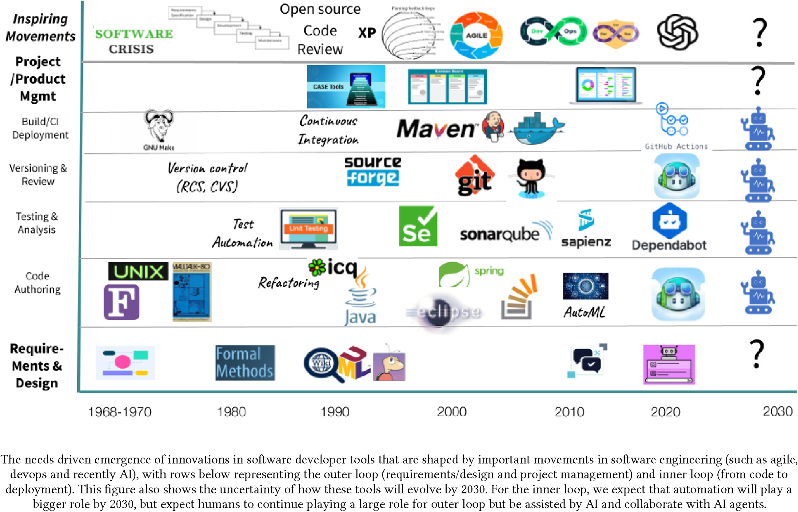
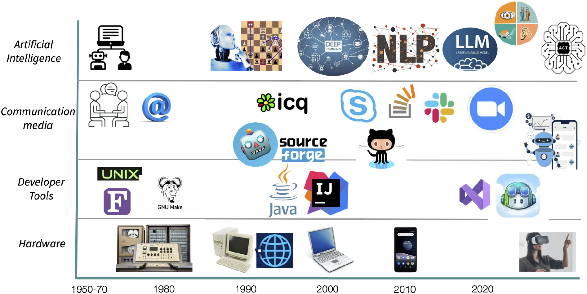
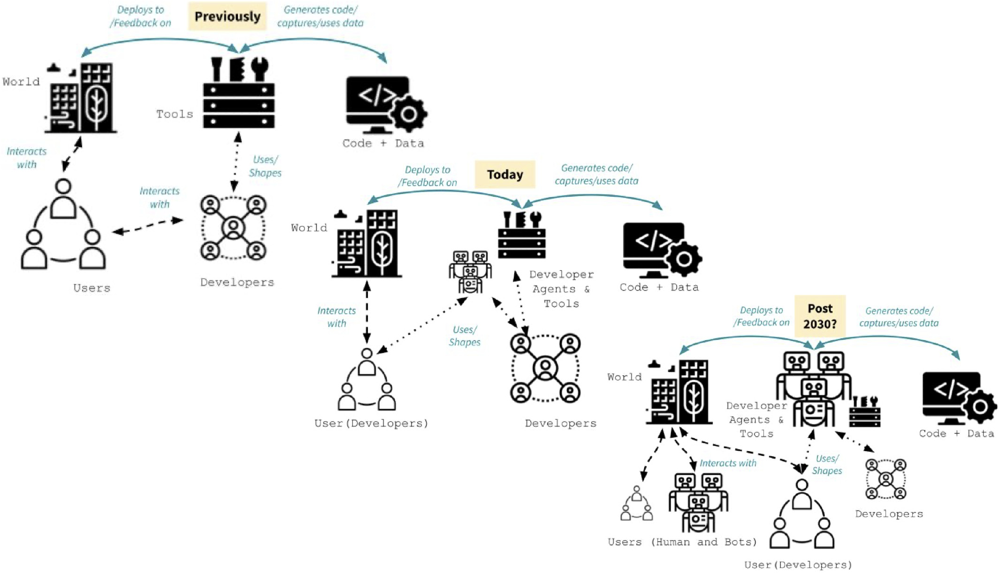

# Chapter 0: Introduction and Motivation - Software Engineering in the AI Era

> Draft v0.4 (2026-09-03). Standalone introduction synthesizing Abrahão et al. (2025), Butler
> et al. (2026), Rico and Öberg (2025), and Osborn (2026).

## Icon Key

- 📘 **Concept**: a core idea or term.
- 🧭 **Principle**: a rule of thumb that guides engineering decisions.
- 🛠️ **Technique**: something engineers actively do.
- 🧱 **Artifact**: a document, test, report, or other work product.
- 🧪 **Exercise**: something to produce, discuss, or reuse in later course work.

## Learning Outcomes

By the end of this chapter, you should be able to:

1. Explain how automation has repeatedly changed software engineering work, tools, abstraction,
   and collaboration.
2. Describe how AI can act as a tool, teammate, user, and component of a software system.
3. Explain and challenge all eight myths about AI and software-engineering productivity using
   context, workflow, quality, adoption, and value.
4. Use four practical forces to examine what AI enhances, obsolesces, retrieves, and reverses.
5. Explain why AI-assisted programming can become *differently difficult* as cognitive effort
   moves from recall and production toward comprehension, validation, and integration.
6. Distinguish potential uses of generative AI from current organizational practice and identify
   the trust challenges that limit adoption.
7. Explain why engineering judgment, evidence, and human responsibility remain essential.
8. Describe the capabilities software testers need to build and communicate justified
   confidence.

## Before You Read: Retrieve and Predict

Without using an AI tool, write a short response to both opening questions:

1. Does it still make sense to study an IT-related discipline?
2. What remains the role of a software engineer if AI can generate code, tests, explanations,
   and designs?

Keep your answers. Revisit them after Sections 11 and 12, then revise one claim and state what
evidence changed or strengthened your position.

What does it mean to study and practise software engineering when generative AI can produce
code, explanations, tests, designs, and other software artifacts? The answer cannot be based only
on what a model can generate in a short demonstration. It requires us to consider the complete
software lifecycle, the organizations in which development happens, and the people affected by
the resulting systems.

The central argument is that AI does not remove the need for software engineering. Instead, it changes where engineering effort and responsibility are located. As producing plausible software artifacts becomes easier, judgment, evidence, verification, and responsibility become increasingly important.

📘 **Core idea: Plausibility is not evidence.** AI can make an artifact look complete and
convincing before anyone has established that it satisfies the right requirement, behaves safely,
or deserves trust. Software engineering supplies the practices for turning plausible output into
justified decisions.

## 1. Two Questions About Software Engineering in the AI Era

We begin with two questions:

> Does it still make sense to study an IT-related discipline?

> What is our role if AI can do "everything"?

These questions reflect a genuine uncertainty created by recent developments in generative AI. Systems can generate code, explain unfamiliar APIs, propose designs, produce tests, summarize documentation, and perform increasingly complex development tasks.

It is therefore reasonable to ask what remains for software engineers to do.

However, answering this question requires looking beyond the current generation of AI tools. Software engineering has repeatedly changed as new technologies automated activities that previously required substantial human effort.

The important question is therefore not simply whether AI can perform particular tasks. We need to understand how automation changes software engineering work, which capabilities become less important, which become more important, and where responsibility ultimately resides.

🧭 **Principle: Ask where the work moves.** When a tool accelerates one activity, examine which
review, coordination, testing, integration, maintenance, or risk-management activities grow around
it.

## 2. Software Engineering Has Always Evolved Through Automation

Automation is not new to software engineering.

The history of the discipline can be understood partly as a sequence of changes in the tools,
processes, abstractions, and communication mechanisms used to build software. Abrahão et al.'s
historical timeline shows automation spreading across the complete lifecycle rather than
remaining confined to code authoring [R1].

*Figure 0.1. Historical evolution of tools supporting the software-engineering lifecycle.
Reproduced from Abrahão et al. (2025), Figure 3, under CC BY 4.0 [R1].*

### 2.1 Processes Change

Software development processes have changed substantially over time.

Approaches such as the Rational Unified Process represented attempts to structure software development through explicit phases, roles, activities, and artifacts. Agile approaches subsequently changed many of these assumptions by emphasizing shorter feedback cycles, incremental delivery, and closer interaction among participants.

AI may produce another transformation. We do not yet know exactly what the resulting development processes will look like.

The important historical observation is that new technologies rarely eliminate software engineering work entirely. Instead, they redistribute it. Some activities become cheaper or easier, while new problems of integration, coordination, verification, and control emerge.

### 2.2 Development Tools Change

The same pattern appears in development tools.

Version control, for example, evolved from earlier centralized systems such as Subversion toward distributed version control systems such as Git. Git emerged from the needs of Linux kernel development and later became the technical foundation for platforms such as GitHub.

These tools did more than automate file management. They changed how developers collaborate, review changes, integrate contributions, and organize software projects.

The relevant lesson for AI is that tools can eventually reshape the practices around them.

### 2.3 Communication and Collaboration Change

Software engineering is also a collaborative activity.

The paper's collaboration timeline connects changes in hardware, development tools,
communication media, and AI. The point is not the sequence of individual products but the way
each layer changes who can participate, how quickly feedback travels, and how work is coordinated
[R1].

*Figure 0.2. Changes in hardware, development tools, communication media, and AI. Reproduced
from Abrahão et al. (2025), Figure 4, under CC BY 4.0 [R1].*

Communication technologies have progressively made geographically distributed software development easier. Teams no longer need to occupy the same physical location to collaborate closely on the same software system.

Development environments, source code platforms, issue trackers, messaging systems, video conferencing, and other collaborative technologies have changed both the speed and the structure of software development.

Automation therefore changes not only *what* individuals can do, but also *how people work together*.

### 2.4 Levels of Abstraction Change

Computing has also repeatedly moved toward higher levels of abstraction.

Programming once involved much closer interaction with physical hardware and machine-level
representations. Higher-level programming languages, frameworks, libraries, APIs, integrated
development environments, and other abstractions progressively allowed developers to express
increasingly complex behaviour without controlling every underlying detail.

A developer using Java, for example, works at a substantially different level of abstraction from someone programming a machine through much lower level mechanisms.

Generative AI may represent another change in abstraction. Developers can increasingly describe intentions, constraints, examples, or desired behaviour and ask an AI system to produce an implementation.

What this future level of abstraction will eventually look like remains uncertain.

## 3. AI Changes the Development Context

AI potentially changes more than the tools available to an individual programmer.

Abrahão et al. describe an evolving development context that includes human and AI users,
developers, agents, and tools [R1].

*Figure 0.3. Evolution of the software-development context. The post-2030 panel represents a
research horizon rather than a prediction. Reproduced from Abrahão et al. (2025), Figure 5, under
CC BY 4.0 [R1].*

The traditional distinction between user, developer, tool, and software system is becoming less clear.

AI can appear in several roles:

- as a tool used by a developer,
- as an active participant or agent performing development tasks,
- as part of the software system being engineered, and
- potentially as a user or consumer of other software systems.

At the same time, generative AI can lower some barriers to software creation.

People without conventional software development backgrounds can increasingly create prototypes and small applications. This is particularly interesting in contexts such as civic technology, where people may use software to address problems in their communities without necessarily identifying themselves as professional software developers.

The boundary of who can participate in software development is therefore shifting.

This does not necessarily imply that professional software developers disappear. Their work may instead increasingly involve integrating contributions, coordinating systems and agents, understanding requirements, evaluating generated artifacts, and deciding whether software is suitable for its intended purpose.

## 4. Generative AI Creates Opportunities and Risks

Generative AI should not be understood simply as either beneficial or harmful to software engineering.

The same capabilities that create opportunities can also create new risks.

### 4.1 Opportunities

Generative AI can make software development more accessible.

People can turn ideas into prototypes without first mastering every implementation detail. Developers can explore unfamiliar APIs, languages, frameworks, and concepts with interactive assistance.

Repetitive activities can increasingly be delegated or partially automated.

AI can also shorten feedback cycles. Instead of waiting to obtain information or manually producing an initial solution, developers can quickly generate something that can be inspected, executed, challenged, and refined.

These capabilities can expand what individuals and teams are able to attempt.

### 4.2 Risks

Lowering the cost of producing software artifacts also lowers the cost of producing *incorrect* software artifacts.

Generative AI can produce outputs that look convincing while containing subtle errors. When generation becomes faster, incorrect assumptions or implementation mistakes can also be reproduced and scaled more quickly.

More generated output may therefore produce more work elsewhere. Someone still needs to review, integrate, test, maintain, and ultimately decide whether that output can be trusted.

AI can also affect developer knowledge and autonomy. If increasingly important decisions are delegated to systems whose reasoning or behaviour is difficult to understand, determining responsibility becomes more complicated.

The positive and concerned perspectives are therefore not descriptions of two separate futures.

They are competing effects of the same technology.

## 5. AI Productivity Depends on Context

Claims about AI and developer productivity require particular care.

Butler et al. challenge several simplified narratives about generative AI in software engineering
[R2]. The paper presents eight myths. They are useful because each myth begins with something
that may be true in a limited situation and then extends it into a general claim that the evidence
does not support. The appropriate response is neither automatic enthusiasm nor automatic
rejection. It is to define the task, boundary, outcome, and evidence.

### 5.1 Myth 1: Developers Spend Most of Their Time Writing Code

The myth treats software development as if most professional effort consisted of typing source
code. Butler et al. summarize studies showing a much broader working day. One Microsoft study of
more than 450 engineers reported that code writing accounted for about 14 percent of their time
[R2]. The precise percentage will vary across roles and organizations, but the larger point is
stable: software engineering includes requirements, design, planning, communication, code
review, testing, debugging, integration, deployment, maintenance, and learning.

**Applied interpretation.** An AI tool may generate a REST controller in two minutes, but that
demonstration excludes the time needed to determine the correct authorization rule, understand
the existing domain model, configure dependencies, review the change, test boundary cases,
integrate it with other services, and support it after release. If we measure only the two minutes
of generation, we have measured the easiest visible slice rather than the work of delivering a
reliable feature.

**Testing example.** Generating a JUnit class quickly is not the same as designing a strong test
suite. The difficult work may be finding the correct test basis, selecting representative cases,
defining trustworthy oracles, controlling dependencies, and explaining residual risk.

🧭 **Better question:** Which parts of the complete activity become faster, and what proportion
of the total work do those parts represent?

### 5.2 Myth 2: Writing Code Is the Bottleneck

Even when code authoring becomes faster, delivery may not. A development system moves only as
quickly as the work that constrains its flow. The constraint may be requirements clarification,
architecture, access to an environment, review, testing, security approval, deployment, or a
decision by another team. Accelerating code generation can therefore move the bottleneck rather
than remove it [R2].

The scale of the opportunity also matters. If code authoring occupies roughly 15 percent of the
work, making that activity twice as fast cannot by itself double overall productivity. In the
paper's simplified calculation, the theoretical overall improvement remains below 15 percent
because most of the work is untouched [R2].

**Applied interpretation.** Imagine that a team previously completed five candidate changes per
week and could review five. With AI, it can generate fifteen, while review capacity remains five.
The result is not three times as much delivered value. It is a growing queue, less time per review,
and pressure to merge work that has not been adequately understood.

**Testing example.** If AI generates hundreds of tests, test execution may become slower and
maintenance more expensive. Duplicated or shallow tests can obscure the few tests that actually
detect important failures. More tests can therefore create a test-suite optimization problem.

🧭 **Better question:** After this activity is accelerated, where does work wait next, and how
does the new queue affect quality and risk?

### 5.3 Myth 3: Lines of AI-Generated Code Are the Best Measure of Impact

Lines of code measure volume, not value. The paper points to longstanding empirical criticism of
lines of code as a valid productivity measure. More code may represent a useful feature,
unnecessary duplication, generated boilerplate, or technical debt. A careful refactoring can
improve a system by deleting code. Counting generated lines rewards production even when the
organization's goal is reliable, maintainable software rather than a larger codebase [R2].

Single-number targets can also change behaviour. If developers are rewarded for generated lines
or completed story points, they gain an incentive to optimize the measure rather than the system.
Review, collaboration, design quality, and maintainability can then appear to slow productivity
even though they protect the product from future cost and failure.

**Applied interpretation.** Suppose an assistant generates 1,000 lines for a feature that could
have reused an existing 100-line component. A dashboard may report substantial AI contribution,
while the team inherits another implementation, more dependencies, duplicated logic, and a
larger maintenance surface. The metric points in the opposite direction from the desired outcome.

**Testing example.** The equivalent mistake in testing is counting test methods without asking
what they detect. Fifty tests that repeat the same happy path provide less evidence than a small
set covering important partitions, boundaries, failures, and interactions.

Useful evaluation combines several forms of evidence, such as lead time, review effort, escaped
defects, change-failure rate, maintainability, user outcome, and the confidence of the people who
must operate the system. No single metric is sufficient.

🧭 **Better question:** What outcome improved, what new cost or risk appeared, and which evidence
connects the AI-supported work to that outcome?

### 5.4 Myth 4: AI Helps All Tasks and Engineers Equally

The effect of AI depends on the task, the developer, the codebase, the prompt, and the surrounding
workflow. Butler et al. review studies reporting positive, neutral, and negative productivity
effects. They also describe evidence that familiar, well-understood tasks can benefit more than
unfamiliar work, and that semantically similar prompts can produce different code and different
correctness outcomes [R2].

The differences are not minor details. One 2025 study discussed in the paper found an average
18-percent increase in implementation time for experienced open-source developers using AI. In a
separate prompt-sensitivity study, semantically equivalent rewrites produced different code in 46
percent of cases and changed correctness in 28 percent [R2]. These findings do not establish that
AI is generally harmful. They show why a result from one task, population, or prompt cannot be
generalized automatically.

**Applied interpretation.** Boilerplate for a familiar framework may be a strong use case because
the patterns are common and the result is easy to compare with known examples. Diagnosing a rare
failure in a proprietary legacy system is different: the model may lack the local architecture,
historical decisions, production data, and organizational constraints required to reason well.

Experience also has a double effect. A novice may obtain a larger apparent speed-up but lack the
knowledge required to detect an invented API or unsafe assumption. An expert may evaluate the
output more reliably but gain less because the task was already familiar. Neither “novices benefit
most” nor “experts benefit most” is universally correct.

**Testing example.** AI may propose conventional boundary tests for a clear numeric range but
struggle with a stateful business rule whose oracle depends on several requirements. Its value
changes with the structure of the test basis.

🧭 **Better question:** For which task, developer, system, and quality criterion was the effect
observed, and does that context match ours?

### 5.5 Myth 5: AI Will Turn Individual Developers into 10x Developers

The “10x developer” story treats productivity as an individual and stable property. Real software
delivery is collaborative. Work crosses product decisions, architecture, implementation, review,
testing, operations, security, and stakeholder feedback. Performance on one isolated task does
not imply tenfold impact across that system [R2].

This is why a frequently repeated result such as a 55-percent gain on a controlled task cannot be
read as a 55-percent gain in organizational delivery, much less proof of a “10x developer.” The
measurement boundary excludes much of the coordination and knowledge sharing required in
real-world software work [R2].

**Applied interpretation.** A developer supported by several agents might produce ten feature
branches while teammates can review only two and the product owner can validate only one. The
individual appears highly productive if branches are counted; the team may deliver no faster and
may now carry more unfinished work.

The story also hides knowledge sharing. A locally fast solution can reduce team performance if no
one else understands it, if architectural decisions are not recorded, or if reviewers must
reconstruct the reasoning from generated code.

**Testing example.** A person who generates many passing tests is not necessarily a stronger
tester. Strong testing depends on what faults the tests can reveal, how well the oracles represent
intended behaviour, and whether the suite remains understandable and maintainable.

🧭 **Better question:** How does AI change the performance, shared understanding, and delivered
outcomes of the team and system, not merely the output of one individual?

### 5.6 Myth 6: It Is Up to Each Developer to Make AI Work

Giving individuals an AI license does not redesign an engineering organization. Sustainable
benefit may require approved tools, secure access to relevant context, training, usage policies,
evaluation criteria, time to experiment, revised review practices, and agreement about where
human decisions remain mandatory. These are organizational responsibilities [R2].

The paper observes that organizations have invested heavily in licenses while the practices for
using them effectively are still emerging. Access is therefore an input, not evidence of improved
performance. As with earlier productivity transformations, value depends on changes to the larger
system of work [R2].

**Applied interpretation.** Consider a developer asked to “use AI more” without guidance. The
developer must independently decide whether source code may be shared, how generated code should
be attributed, which tasks are suitable, how to verify the output, and how to explain failures.
Different developers create incompatible practices, while the organization attributes weak
results to individual resistance. The missing element is a supported workflow, not motivation
alone.

**Testing example.** An organization that permits generated tests should also define evidence
expectations: tests must trace to a test basis, run in CI, use reviewed oracles, expose important
limitations, and receive independent challenge where risk is high.

🧭 **Better question:** Which organizational conditions, controls, training, and workflow changes
are required for people to use the tool effectively and responsibly?

### 5.7 Myth 7: High-Performing AI Tools Will Be Adopted Automatically

Technical capability is only one condition for adoption. Trust, usability, workflow fit,
autonomy, learning time, privacy, environmental concerns, fear of de-skilling, and perceptions of
professional competence also matter. Butler et al. discuss a competence penalty in which some
people may be judged more harshly for using AI even when their output is identical, as well as a
gap between tool use and trust in tool accuracy [R2].

The paper illustrates that gap with survey figures: 80 percent of developers reported using AI
tools, while only 29 percent reported trusting their accuracy [R2]. Frequency of use and justified
trust are therefore different variables. The competence penalty also means adoption can carry a
social cost, reported particularly for women and older engineers, even when the resulting work is
the same.

**Applied interpretation.** A tool can score well on a benchmark and still fail in practice if it
interrupts developers, cannot access the relevant repository safely, produces changes that are
difficult to review, or creates uncertainty about ownership. Mandatory adoption can further
reduce trust when people cannot choose how the tool participates in their work.

**Testing example.** A test generator may find useful cases but remain unused if developers cannot
understand why a test was generated, if the tests are flaky, or if maintenance costs exceed the
initial benefit. Explainability and controllability are therefore practical adoption qualities,
not decorative extras.

🧭 **Better question:** What would make intended users trust, understand, and integrate this tool
into real work, and what evidence shows that adoption is beneficial rather than merely frequent?

### 5.8 Myth 8: With GenAI, Enterprises Can Innovate at Startup Speed

Startups and established enterprises operate under different constraints. A startup may build a
greenfield prototype using public frameworks and tolerate rapid change. An enterprise may depend
on proprietary or legacy systems, contractual interfaces, regulated data, compliance approval,
backward compatibility, and customers who expect production reliability. AI can help in both
settings, but it does not erase these structural differences [R2].

**Applied interpretation.** Generating a new payment-service prototype is not equivalent to
changing a payment service used across several countries. The enterprise change may require data
migration, compatibility testing, security review, audit evidence, operational monitoring,
rollback planning, and coordination with many dependent teams. These activities represent real
quality obligations, not avoidable bureaucracy.

**Testing example.** A startup may validate an early feature with a small user group. An
enterprise may need regression testing across many integrations, performance environments,
accessibility requirements, security controls, and contractual service levels before release.

🧭 **Better question:** Which constraints explain the delivery time, which can AI genuinely
reduce, and which must remain because they protect users, systems, and organizational obligations?

### 5.9 What the Eight Myths Have in Common

The myths share a pattern: they substitute a visible local measure for a broader engineering
outcome.

| Myth focuses on | What it overlooks | Evidence needed |
|---|---|---|
| Time writing code | The rest of the lifecycle | End-to-end work distribution |
| Coding speed | Constraints and queues elsewhere | Flow and bottleneck evidence |
| Lines generated | Quality, value, and maintenance | Outcome and lifecycle measures |
| Average benefit | Task, person, system, and prompt variation | Context-specific evaluation |
| Individual output | Team throughput and shared understanding | Team and delivery outcomes |
| Personal tool skill | Organizational workflow and governance | Supported-practice evidence |
| Benchmark performance | Trust, usability, autonomy, and fit | Adoption-quality evidence |
| Startup velocity | Legacy, scale, regulation, and reliability | Comparable-context evidence |

The practical conclusion is not that AI has no productivity value. It is that productivity is a
socio-technical property. Claims about improvement must connect tool use to meaningful outcomes
across people, process, software, and time.

## 6. Programming Is Becoming Differently Difficult

The eight myths challenge claims that AI automatically increases software-engineering
productivity. Osborn offers a complementary cognitive argument: AI did not simply make
programming easier; it changed *where the difficulty is located* [R4].

Programming has historically required developers to maintain and manipulate several interacting
abstractions. Syntax, APIs, control flow, data flow, state, and architecture compete for limited
working memory, while long-term memory supplies familiar patterns and problem-solving strategies.
Stable mental models allow a developer to predict how a change will propagate through a system.
They are cognitively expensive to construct, fragile under interruption, and expensive to rebuild.

AI coding assistants can act as external memory. They retrieve syntax, generate boilerplate,
reconstruct common API patterns, and produce variants without requiring the developer to recall
every low-level detail. Osborn connects this to three ways of understanding cognition [R4]:

- **Distributed cognition:** thinking is performed by a system that includes people and external
  artifacts, not only by an isolated individual.
- **Cognitive load theory:** offloading syntax and boilerplate may reduce extraneous load and leave
  more working-memory capacity for higher-level reasoning.
- **The extended mind:** a reliably available and habitually used assistant can become part of the
  programmer's effective cognitive process, shaping how problems are understood and solved.

This redistribution creates a hybrid cognitive system. The machine retrieves patterns and drafts
candidate solutions. The human shapes intent and must check, interpret, integrate, reorganize,
edit, or reject the result. The hard question moves from **“How do I write this?”** toward
**“Does this make sense here, and how would I know?”** [R4].

### 6.1 What AI Can Offload

AI can reduce the immediate cost of:

- recalling exact syntax and library details,
- producing routine or repetitive code,
- finding common API usage patterns,
- generating a first-pass implementation, and
- reconstructing a previously expressed solution in another form.

This can lower the entry barrier to programming and help experienced developers preserve
attention for the larger problem. It also explains why students and practitioners can complete
some tasks faster.

However, faster completion and deeper learning are different outcomes. Osborn discusses research
in which AI assistance improved task performance or progress while gains in learning and ease of
understanding were small or unstable. Students working faster also reported uncertainty about how
or why suggestions worked [R4]. An artifact can therefore improve before the person's mental model
improves.

### 6.2 What AI Does Not Remove

Syntactically valid code can still be semantically wrong, inappropriate for the system, insecure,
or difficult to maintain. Developers still need enough structural understanding to ask “why” and
“why not,” simulate likely behaviour, identify causal paths, and detect when a plausible solution
violates a less visible constraint.

The work that remains includes:

- conceptual clarification and problem decomposition,
- architectural reasoning and interface design,
- impact analysis across a codebase,
- debugging, refactoring, and maintenance,
- constraint negotiation and security reasoning,
- constructing tests and trustworthy oracles, and
- integrating generated output into human-directed intent.

These activities depend on durable mental models. Excessive offloading can weaken those models: a
developer may receive increasingly capable output while becoming less able to predict, explain,
or repair the resulting system. AI therefore shifts cognitive load rather than eliminating it.

### 6.3 Four Shifts in Programming Work

Osborn organizes the change into four shifts [R4]:

1. **The field opens.** Lower recall barriers allow more people to begin producing software, but
   producing *good* software still requires judgment about systems and consequences.
2. **The work becomes differently difficult.** Syntax and API problems become less prominent,
   while appropriateness, maintainability, integration, and system constraints become more
   prominent.
3. **Education changes.** Memorization becomes less central, while architecture, interfaces,
   state, failure modes, test construction, security, and long-term maintainability become more
   important. Students still need to analyse and modify what AI produces.
4. **The programmer becomes an orchestrating agent.** Expertise increasingly means maintaining
   system integrity, coordinating human and machine contributions, and deciding what matters—not
   merely remembering the most or typing the fastest.

This is not an argument that foundational knowledge is obsolete. Judgment requires something to
judge *with*. A developer who cannot read code, trace state, understand dependencies, or recognize
relevant quality risks cannot reliably validate an assistant's output.

### 6.4 Why This Strengthens the Case for Testing

Testing is one of the practices through which judgment becomes explicit and inspectable. If AI
produces a candidate implementation, a tester must still determine:

- which requirement or risk provides the test basis,
- which inputs and conditions can expose a failure,
- which oracle distinguishes acceptable from unacceptable behaviour,
- whether generated tests share the implementation's assumptions,
- what the observed evidence supports, and
- what remains outside the evidence.

For example, an assistant may generate a booking method and a passing test. Both artifacts may
assume that a wallet is charged before the provider accepts the booking, even though the intended
business rule says the opposite. Execution alone cannot reveal the shared misunderstanding. A
reviewed requirement, an independently designed decision table, or a stakeholder example is
needed to challenge the common assumption.

🧭 **Principle: Preserve the mental model while offloading mechanics.** Delegate recall and
routine transformation when useful, but retain enough system understanding to predict behaviour,
challenge output, explain evidence, and recover when the tool is wrong.

🧪 **Discussion: Where did the difficulty move?** Choose one activity in which you use AI—for
example learning an API, implementing a feature, debugging, or constructing tests—and answer:

1. What recall, search, or production work did AI reduce?
2. What comprehension, validation, integration, or maintenance work became more important?
3. Which internal mental model do you still need in order to detect a plausible error?
4. What test or other independent evidence would expose the most important shared blind spot?

Finish with one conditional claim: **“AI makes this activity easier when ..., but differently
difficult because ...”**

## 7. Four Forces for Examining AI-Mediated Change

Abrahão et al. use McLuhan's Tetrad to examine disruptive technologies through four connected
effects [R1]. We can translate the tetrad into practical questions about our own work and
learning.

| Practical label | Tetrad term | Question to ask | Example to examine |
|---|---|---|---|
| **Can do now** | Enhances | What can AI help me create, understand, or attempt that was previously out of reach? | Produce a runnable prototype from a partial idea |
| **Need less** | Obsolesces | Which task or knowledge appears less necessary, and what might be lost with it? | Recall syntax while losing familiarity with the underlying API |
| **Matters more** | Retrieves | Which human skill, older practice, or knowledge becomes valuable again? | Requirements clarification, review, source checking, and explicit rationale |
| **Can backfire** | Reverses | When pushed too far, how can the benefit become dependence, error, or harm? | Faster generation produces more weak code than a team can review safely |

The four forces should not be treated as four independent lists. They reveal tensions. A tool may
enhance exploration while obsolescing some routine knowledge. That change may retrieve the need
for careful review and reverse into dependence when users can no longer assess the generated
work.

🛠️ **Technique: Four-forces analysis.** Name a concrete AI-supported practice, answer all four
questions, then connect at least two answers with a cause-and-effect statement. The connections
are more informative than isolated predictions.

🧪 **Collaborative activity: AI and our work.** Add one concrete example to each of the four
areas. Read several peer examples, respond to two with a consequence, counterexample, or
question, and revise one original answer. The group output is one contested change and one
capability that future IT professionals should protect or strengthen. This can be completed on a
shared board or as a written exchange; the reasoning does not depend on a particular tool.

## 8. AI Adoption Happens Inside Organizations

Software developers rarely work in isolation.

They work within organizations that have processes, responsibilities, policies, legacy systems, security constraints, management structures, and established ways of working.

Consequently, the technical capability of an AI tool and its organizational adoption are different questions.

### 8.1 Top-Down Adoption

In a top-down approach, management identifies AI as strategically important and encourages or
mandates its adoption.

This can provide resources, infrastructure, governance, and organizational legitimacy.

However, a management decision does not automatically translate into useful changes in everyday development practice.

### 8.2 Bottom-Up Adoption

Adoption can also emerge from developers experimenting with tools and incorporating them into their own workflows.

This may reveal useful applications quickly because adoption starts from concrete development problems.

However, local experimentation does not automatically become an organizational capability either.

Understanding AI adoption therefore requires examining both the technology and the organization in which it is introduced.

## 9. Potential Use Is Different from Actual Use

Rico and Öberg's study of managers' perspectives on generative AI in software engineering
illustrates this distinction [R3]. The workshop compared potential applications, current uses
reported by participating organizations, and challenges associated with adoption.

| Task area | Potential uses | Current uses | Key challenges |
|---|---|---|---|
| Requirements and design | Generate or refine requirements; propose designs | Limited or pilot use | Ambiguous outputs; organizational hesitation around non-coding tasks |
| Code development and maintenance | Real-time suggestions; debugging; optimization | ChatGPT and Copilot in active use; some automated documentation | Intellectual-property concerns; code quality and security; long-term maintainability |
| Testing and quality assurance | Generate tests; create synthetic data | Mostly internal trials or prototypes | Correctness of generated tests; high trust threshold for quality-assurance work |
| Management and education | Estimate effort; support internal training and prompt engineering | Skill-building workshops; limited estimation pilots | Uncertain long-term impact; privacy of training data |

For software testing, the most relevant gap concerns testing and quality assurance. Managers could
identify clear potential applications, including test generation and synthetic test data, while
actual organizational use often remained at the level of internal experiments or prototypes.

One central problem was trust.

Generating a test is relatively easy. Determining whether that test is *correct* is a different problem.

A generated test may compile and pass while testing the wrong behaviour, encoding an incorrect assumption, or providing weak evidence about the system.

The study represents the situation observed during that period. AI tools and organizational
practices continue to evolve rapidly. The more general observation remains useful:
**technical potential does not automatically become reliable organizational practice.**

🧭 **Principle: Separate capability from evidence of use.** A tool demonstration establishes
that an activity may be possible. It does not establish that the activity is reliable,
maintainable, secure, accepted by practitioners, or valuable in an organizational workflow.

## 10. AI Increases the Value of Engineering Judgment

Generative AI substantially reduces the cost of producing a plausible answer.

That makes another capability increasingly important: deciding whether the answer should be accepted.

Engineering judgment can be organized around three questions.

### 10.1 What Matters?

Engineers need to understand the purpose of the system.

Who are its users?

What requirements matter?

Which values and constraints should guide the system?

What risks are important?

An AI system cannot make these questions disappear by producing an implementation.

### 10.2 What Is Credible?

Software engineers also need to evaluate evidence.

Where did a claim come from?

Which assumptions does it depend on?

Can the result be reproduced?

What evidence supports accepting the generated artifact?

An answer that looks plausible is not necessarily an answer that is justified.

### 10.3 What Could Fail?

Engineering also requires anticipating failure.

What happens at boundaries?

How do components interact?

How might the system be misused?

What happens when its environment changes?

What remains uncertain?

AI can propose solutions to these questions. Engineers still need to determine whether those solutions provide sufficient evidence for action.

## 11. Responsibility Remains Human

Engineering judgment leads directly to responsibility.

Three additional questions become important.

### 11.1 What Should We Accept?

Every software system contains trade-offs and residual risks.

Someone must decide whether the available evidence is sufficient to release, deploy, or continue operating a system.

### 11.2 Who Is Affected?

Software decisions affect stakeholders.

Consequences can involve accessibility, fairness, privacy, sustainability, security, and other dimensions that extend beyond whether the program executes successfully.

### 11.3 Who Is Responsible?

AI can participate in development activities, but organizations still require mechanisms for oversight, escalation, recovery, and accountability.

This distinction leads to one of the central messages of this chapter:

> **Making software is not the same as engineering software responsibly.**

The reason to study software engineering therefore does not disappear simply because machines become better at generating software artifacts.

The work increasingly involves **judgment, evidence, consequences, and responsibility**.

## 12. From AI to Software Testing: Building Justified Confidence

This argument provides a central motivation for software testing.

Software testing is not merely the activity of finding bugs.

A broader objective is to develop **justified confidence in software**.

Confidence should not come from the fact that an implementation looks plausible, that an AI system produced it, that the program compiled, or even that a collection of tests passed.

Confidence should be supported by evidence.

A capable tester learns to:

- turn requirements and risks into purposeful tests
- automate repeatable checks using professional tools
- interpret coverage, mutation, continuous integration, and failure evidence
- audit plausible AI-generated work rather than accepting it at face value
- reason about people, sustainability, and consequences

Testing therefore connects directly to the challenge introduced at the beginning of this chapter.

As generating software becomes easier, establishing whether that software deserves our confidence becomes increasingly important.

## 13. Capabilities Needed in Software Testing

Software testing requires more than knowing how to run a tool or write a test method. Testers need
four connected capabilities that turn observations into defensible conclusions about quality and
risk.

### 13.1 Frame and Explain

A tester must explain what quality means for the system, who values each quality characteristic,
and which risks deserve attention. Precise distinctions—such as error, fault, failure,
verification, and validation—help connect an observed problem to its possible causes and
consequences.

This capability also includes framing bounded claims. “The system works” is too broad. “The
booking rule behaves as specified for the identified duration boundaries” states what is being
claimed and where the evidence applies.

### 13.2 Design

A tester must translate requirements, risks, system structure, changes, and failure hypotheses
into purposeful tests. This involves choosing suitable techniques rather than generating cases at
random. Specification-based, structural, regression, mutation, and AI-system testing answer
different questions and expose different blind spots.

Test design also requires a credible oracle: a reasoned basis for deciding whether an observed
result is acceptable. An automatically generated expected value is not trustworthy merely because
it appears beside an automatically generated test.

### 13.3 Execute and Interpret

Testers use automation frameworks, controlled dependencies, coverage tools, mutation systems,
continuous integration, logs, and other artifacts to make checks reproducible. The central skill,
however, is interpreting what the result demonstrates.

A passing test shows that one check produced its expected result under particular conditions. A
coverage report shows which structures executed. A mutation result shows whether selected changes
were detected. None of these observations alone establishes that the system is correct, safe, or
fit for every purpose.

### 13.4 Evaluate and Communicate

Testers evaluate the credibility and relevance of sources, generated artifacts, measurements, and
research claims. They compare evidence produced through different assumptions and identify shared
blind spots. They also consider residual risk and broader consequences involving stakeholders,
security, accessibility, fairness, privacy, and sustainability.

The result must be communicated honestly: what was tested, what was observed, what conclusion is
supported, and what remains uncertain. This makes testing evidence usable in engineering and
release decisions.

These capabilities return us to the opening questions.

AI may change what software engineers produce and how they produce it. The corresponding testing
challenge is to determine **what matters, what evidence is credible, what could fail, and what we
are prepared to accept responsibility for**.

## 14. Summary and Self-Check

Software engineering has repeatedly changed as tools, abstractions, and collaboration mechanisms
have changed. Generative AI is another major transformation, but faster artifact production does
not remove requirements, integration, verification, maintenance, consequences, or responsibility.
It changes where the difficult work appears.

The four readings provide complementary perspectives. Abrahão et al. describe an AI-mediated,
human-centred software ecosystem and supply the four-forces lens. Butler et al. challenge simple
productivity stories and show why task and organizational context matter. Osborn explains the
cognitive relocation from recall and routine production toward mental models, reasoning,
validation, and orchestration. Rico and Öberg show a gap between potential applications and
current company practice, especially where a high trust threshold applies.

Software testing responds by building justified confidence. Tests, reviews, coverage, mutation,
continuous integration, research, and critical reflection contribute different evidence to
bounded claims. People still decide what matters, what evidence is credible, what could fail,
what risk to accept, and who is affected.

Before continuing, check whether you can answer these questions:

1. How has automation historically redistributed software engineering work?
2. In which four roles can AI appear in the development context?
3. Why does faster code generation not guarantee faster software delivery?
4. What does it mean to say that AI makes programming differently difficult?
5. Which mental models must a developer preserve when AI offloads syntax and boilerplate?
6. What do enhances, obsolesces, retrieves, and reverses ask you to examine?
7. What is the difference between a potential use and reliable organizational practice?
8. Why is a passing AI-generated test not automatically credible evidence?
9. What do the questions “What matters?”, “What is credible?”, and “What could fail?” contribute
   to engineering judgment?
10. Which four capabilities are needed to turn testing observations into defensible conclusions?
11. What evidence should accompany a passing build or coverage number?
12. How would you now answer the two opening questions?

## References and Further Reading

[R1] Silvia Abrahão, John Grundy, Mauro Pezzè, Margaret-Anne Storey, and Damian A. Tamburri.
"Software Engineering by and for Humans in an AI Era." *ACM Transactions on Software
Engineering and Methodology*, 34(5), Article 129, 2025.
https://doi.org/10.1145/3715111

[R2] Jenna Butler, Brian Houck, Margaret-Anne Storey, Travis Lowdermilk, Steven Clarke, and
Emerson Murphy-Hill. "Eight Myths on Software Engineering and GenAI." 2026.
https://doi.org/10.1145/3807963

[R3] Sergio Rico and Lena-Maria Öberg. "Challenges and Opportunities for Generative AI in
Software Engineering: A Managerial View." *Proceedings of the 33rd ACM International Conference
on the Foundations of Software Engineering*, 1338-1344, 2025.

[R4] Jeremy Osborn. "AI Didn't Make Programming Easier. It Just Made It Differently Difficult."
*Communications of the ACM*, 69(8), 18-21, 2026. Licensed under CC BY 4.0.
https://doi.org/10.1145/3795534
